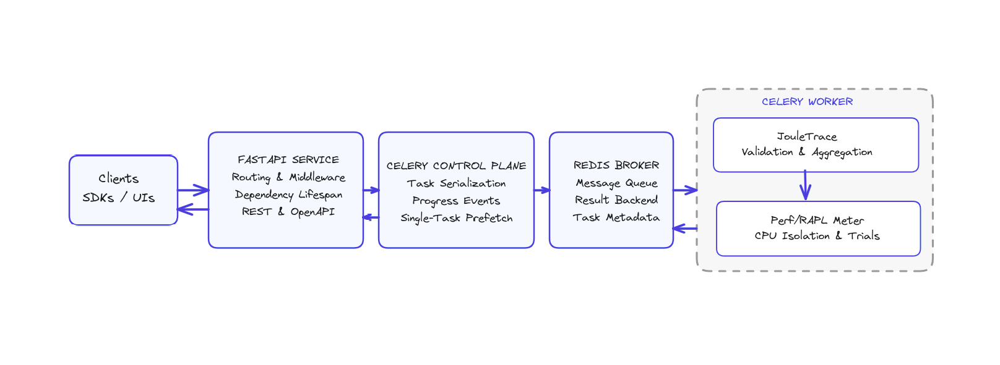

# JouleTrace Energy Measurement Service

JouleTrace measures how much energy a piece of code burns while it runs. It wraps FastAPI, Celery, Redis, and a hardware energy meter (`perf` + RAPL) into a production-ready pipeline that validates code, isolates CPU resources, repeats trials, and reports median joule totals.

## Highlights
- Hardware-backed joule readings through Linux `perf stat` RAPL counters.
- Strict correctness gate before measuring energy so comparisons stay apples-to-apples.
- CPU pinning, thermal checks, and deterministic trials for fair multi-core measurement.
- Asynchronous Celery workflow with Redis so long measurements never block the API.
- Batteries-included observability: structured logs, task progress events, health endpoints.

## Architecture at a Glance


**End-to-end flow**
1. **Clients** (SDKs, CLI tools, UI dashboards) queue measurement requests via FastAPI.
2. The **FastAPI service** validates payloads, enqueues background work, and exposes health, docs, and metrics.
3. The **Celery control plane** serializes jobs, emits progress events, and guarantees one in-flight task per worker for isolation.
4. **Redis** acts as broker/result backend, carrying task metadata and final measurements.
5. A pinned **Celery worker** hosts the JouleTrace pipeline plus the Perf/RAPL energy meter to perform validation, CPU isolation, warmups, trials, aggregation, and reporting.

## Request Life Cycle
1. Payload is validated and written to Redis as a Celery task (`POST /api/v1/measure`).
2. Worker loads the code into a sandbox, runs all test cases with time & memory limits (`SafeCodeExecutor`).
3. If correctness passes, `CPUIsolationManager` pins the process to a quiet core, cools the CPU, and performs warmups.
4. `PerfEnergyMeter` executes the function several times under `perf stat`, collecting package/RAM joules per trial.
5. `JouleTracePipeline` aggregates medians, attaches environment metadata, and stores the result for polling (`GET /api/v1/tasks/{id}`).

## Repository Layout
| Path | Purpose |
| --- | --- |
| `jouletrace/api` | FastAPI entry point (`service.py`), request schemas, routes, background task wiring, Celery task definitions. |
| `jouletrace/core` | Core orchestration: models, validation engine, safe sandbox executor, CPU isolation, and the main measurement pipeline. |
| `jouletrace/energy` | Energy meter abstractions and the `PerfEnergyMeter` backend that shells out to `perf` + RAPL. |
| `jouletrace/infrastructure` | Configuration loading, structured logging setup, health/monitoring helpers. |
| `docker/` | Dockerfile and `docker-compose.yml` for the full stack (API, Celery workers, Redis, Flower dashboard). |
| `docs/` | Supplemental docs; `docs/USAGE.md` contains an extended CLI walkthrough (image assets live in `docs/assets/`). |
| `demonstration.ipynb`, `effi.ipynb`, `try.ipynb` | Exploratory notebooks demonstrating API usage, data analysis, and energy comparisons. |
| `requirements.txt` | Python dependencies for local development. |

## Getting Started
### Requirements
- Linux x86_64 host with Intel/AMD RAPL support (`cat /sys/class/powercap/intel-rapl` to verify).
- Python 3.10+ for local development.
- `perf` userspace tooling (`linux-perf` on Debian, `linux-tools-generic` on Ubuntu).
- Redis (only if you are not using the provided Docker Compose stack).

### Quick Start (Docker Compose)
1. Build and launch the stack:
   ```bash
   docker compose -f docker/docker-compose.yml up -d --build
   ```
2. Health check the API:
   ```bash
   curl http://127.0.0.1:8000/ping
   ```
3. Submit a measurement and poll results (see `docs/USAGE.md` for full `curl` examples).
4. Visit Flower for task monitoring: http://127.0.0.1:5555.

### Local Development (without Docker)
1. Create a virtual environment and install dependencies:
   ```bash
   python -m venv .venv
   source .venv/bin/activate
   pip install -r requirements.txt
   ```
2. Export configuration (defaults read from env vars, see below). Example minimal setup:
   ```bash
   export CELERY_BROKER_URL=redis://localhost:6379/0
   export CELERY_RESULT_BACKEND=redis://localhost:6379/0
   export ENERGY_USE_SUDO=true          # allow perf via sudo inside worker
   export ENERGY_MEASUREMENT_CORE=0     # pin worker to CPU core 0 (choose an idle core)
   export ENERGY_PERF_TIMEOUT=60
   ```
3. Run the API:
   ```bash
   uvicorn jouletrace.api.service:app --host 0.0.0.0 --port 8000 --reload
   ```
4. Start a Celery worker (one per physical core, `--concurrency=1`):
   ```bash
   celery -A jouletrace.api.tasks worker --loglevel=info --concurrency=1 --hostname=worker-0@%h
   ```
5. Ensure the worker has permission to run `perf` (either `sudo setcap cap_perfmon+ep $(command -v perf)` or allow passwordless sudo for `/usr/bin/perf`).

## Configuration Cheat Sheet
Environment variables are parsed via `jouletrace.infrastructure.config`. Key knobs include:
- `ENERGY_DEFAULT_TIMEOUT`, `ENERGY_DEFAULT_MEMORY_LIMIT` – per-test execution budget.
- `ENERGY_MEASUREMENT_TRIALS`, `ENERGY_WARMUP_TRIALS` – number of perf trials and warmups.
- `ENERGY_MEASUREMENT_CORE`, `ENERGY_ISOLATE_PROCESSES`, `ENERGY_DISABLE_FREQUENCY_SCALING` – CPU isolation behavior.
- `ENERGY_PERF_TIMEOUT`, `ENERGY_USE_SUDO` – perf execution settings.
- `CELERY_BROKER_URL`, `CELERY_RESULT_BACKEND`, `CELERY_TASK_SOFT_TIME_LIMIT`, `CELERY_TASK_TIME_LIMIT` – task queue wiring.
- `API_WORKERS`, `LOG_LEVEL`, `LOG_JSON_LOGGING` – service runtime controls.
Refer to `docker/docker-compose.yml` for a full catalog of defaults.

## Energy Measurement Best Practices
- Run exactly one Celery worker per physical core and set `--concurrency=1` for deterministic measurements.
- Keep workers pinned to distinct cores using Docker `cpuset` or OS affinity.
- Allow warmup trials for small workloads; drop to a single trial for heavy jobs to speed up benchmarking.
- Keep the machine quiet—avoid co-scheduling noisy services on the same CPU package.
- Monitor `kernel.perf_event_paranoid`; set to `0` or `-1` (or rely on sudo) so `perf` can read RAPL counters.
- Use median energy values exposed in the API response to compare implementations.

## API Overview
| Endpoint | Description |
| --- | --- |
| `POST /api/v1/measure` | Queue a measurement job; returns `task_id` and poll URL. |
| `GET /api/v1/tasks/{task_id}` | Poll job state (`queued`, `running`, `completed`, `failed`). |
| `POST /api/v1/validate` | (Optional) quick correctness-only check without energy readings. |
| `GET /api/v1/health` | Aggregated health, dependency status, and energy meter availability. |
| `GET /ping` | Simple liveness probe. |

OpenAPI docs live at `/docs` when the service is running. See `docs/USAGE.md` for detailed request/response payloads and troubleshooting tips.

## Further Reading
- `docs/USAGE.md` – end-to-end walkthrough, troubleshooting diary, and operational checklist.
- `jouletrace/core/pipeline.py` – orchestrates validation, CPU isolation, measurement, and aggregation.
- `jouletrace/energy/perf_meter.py` – translates `perf stat` output into joule readings.
- `jouletrace/core/cpu_isolation.py` – CPU affinity, thermal gating, frequency governor helpers.

---

JouleTrace is distributed under the MIT License. Contributions and suggestions are welcome—open an issue or submit a PR with reproducible scenarios and measurement notes.
