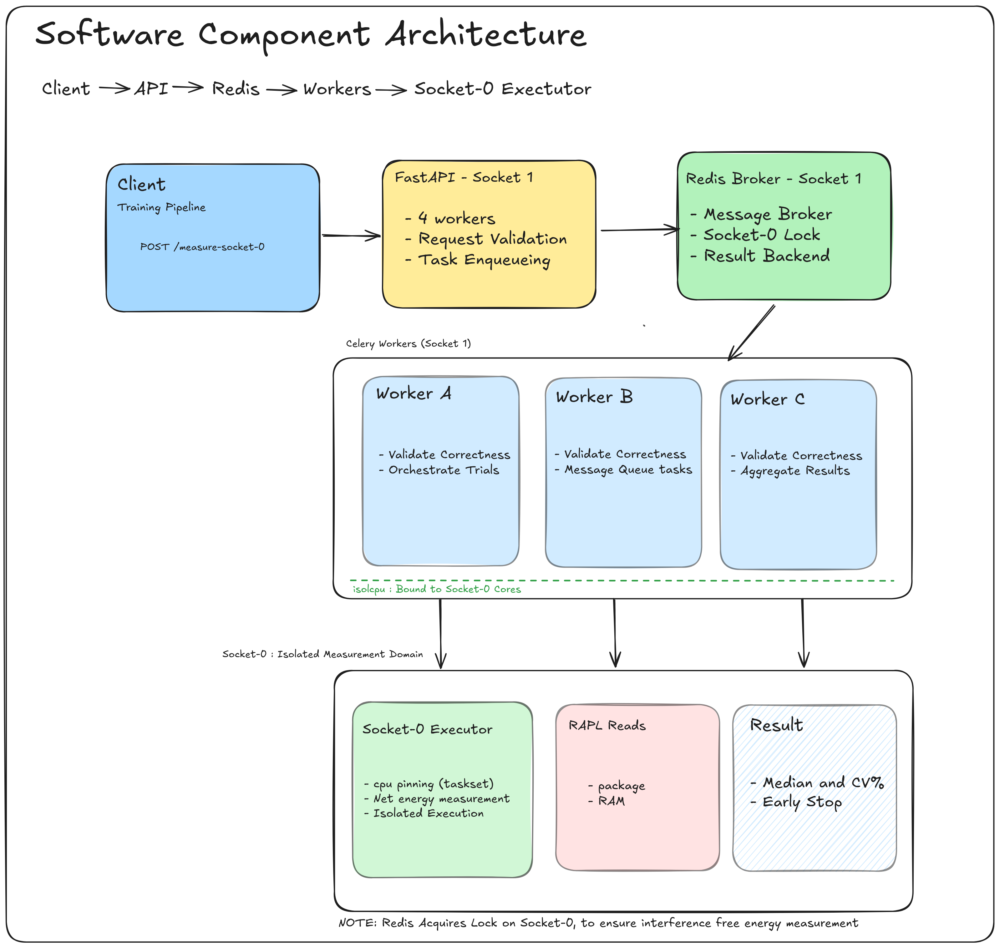

# JouleTrace Usage (Socket‑0, PCM‑Backed)

JouleTrace measures code energy on an isolated CPU socket using per‑socket RAPL sysfs counters. This guide shows how to run the service, submit measurements, and interpret results.

## Software Component Architecture

Client → API → Redis → Workers → Socket‑0 Executor



## Prerequisites
- Linux x86_64 host with RAPL support: `/sys/class/powercap/intel-rapl` exists.
- Docker + Docker Compose v2.
- Socket‑0 calibration file at `config/socket0_calibration.json` (fresh ≤7 days).
- Containers can read `/sys` (mounted read‑only) and workers run privileged/root.

## Quick Start (Docker Compose)
1) Build and start
- `docker compose -f docker/docker-compose.yml up -d --build`

2) Verify
- `curl http://127.0.0.1:8000/ping`
- `curl -s http://127.0.0.1:8000/api/v1/socket0/status | jq`
- Flower: `http://127.0.0.1:5555`

3) Submit + poll
```
RESP=$(curl -sS -X POST http://127.0.0.1:8000/api/v1/measure-socket0 \
  -H 'Content-Type: application/json' \
  --data-binary @- <<'JSON'
{"candidate_code":"def solve(x):\n  return x * x\n","function_name":"solve","test_cases":[{"test_id":"t1","inputs":[2],"expected_output":4},{"test_id":"t2","inputs":[7],"expected_output":49}],"energy_measurement_trials":3,"timeout_seconds":20}
JSON
)
echo "$RESP" | jq .
TASK_ID=$(echo "$RESP" | jq -er .task_id)
curl -sS "http://127.0.0.1:8000/api/v1/tasks/$TASK_ID" | jq .
```

## Endpoints
- `POST /api/v1/measure-socket0` – queue a Socket‑0 measurement (primary)
- `GET /api/v1/tasks/{task_id}` – poll status (`queued|running|completed|failed`)
- `POST /api/v1/validate` – quick correctness check (no energy)
- `GET /api/v1/socket0/status` – calibration/isolation/Redis readiness
- `GET /api/v1/health` – system health

## Response (example)
```
{
  "status": "completed",
  "validation": {"is_correct": true, "passed_tests": 2, "total_tests": 2},
  "energy_metrics": {
    "median_package_energy_joules": 1.40,
    "median_ram_energy_joules": 1.50,
    "median_total_energy_joules": 2.90,
    "median_execution_time_seconds": 0.2066,
    "energy_per_test_case_joules": 1.45,
    "power_consumption_watts": 14.06
  }
}
```

## How measurement works
- Correctness first: code must pass all test cases.
- Socket‑0 lock: only one measurement at a time.
- Pinning: child process is pinned to a dedicated core via `taskset`.
- Trial timing: the executor repeats the test inputs inside the child until the trial wall time ≥ a minimum (default 0.2 s) to stabilize RAPL deltas.
- RAPL deltas: read package + DRAM counters before/after; subtract calibrated idle baseline from package; sum package_net + dram_raw for total.
- Statistics: run multiple trials, compute medians, and early‑stop when CV < target.

## Best practices
- Target ≥100–200 ms per trial; tiny functions otherwise yield noisy power.
- Prefer quiet hosts and keep Socket‑0 isolated; pin workers away from Socket‑0 cores except the measurement core used by the child.
- Keep calibration fresh; recalibrate if ambient/thermal conditions change.

## Troubleshooting
- `503 Socket 0 not calibrated`: run calibration and place file under `config/`.
- DRAM energy = 0: your CPU may not expose a DRAM RAPL domain; package/total still valid.
- `All trials failed`: container `cpuset` must include the measurement core; ensure `util-linux` (taskset) is present.
- Permission errors reading RAPL: ensure `/sys` is mounted and containers are privileged/root.

## Notes
- DRAM net: we report DRAM raw delta today. If you need net DRAM energy, extend calibration to include a DRAM idle baseline and subtract it similarly to package.
